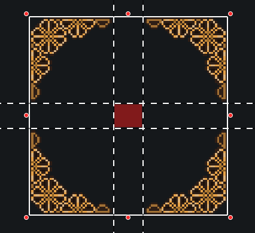
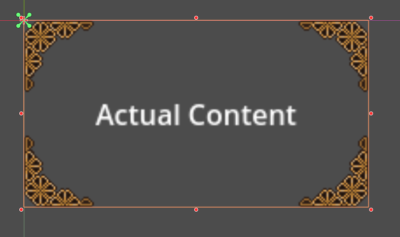
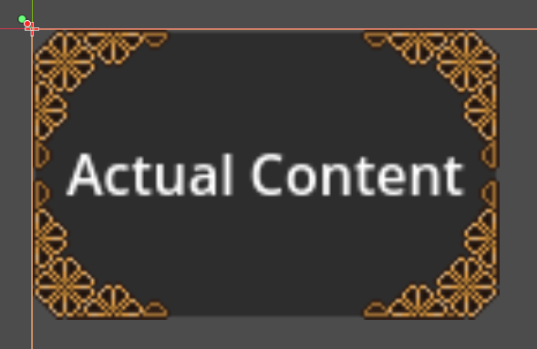

# NinePatchContainer

A custom Godot control that provides enhanced nine-patch container functionality with support for customizable background, frame, and content margins.

## Overview

While Godot provides built-in support for nine-patch rectangles and basic nine-patch containers  (`PanelContainer` with a custom `StyleBoxTexture`), these implementations have limitations:
- Content is always placed only in the middle cell of the nine-patch.  In the following image, the content is only rendered in the red square.   Depending on styling, this can be highly undesirable and lead to excessive padding.



- Background customization is limited.  If your background is not part of the nine-patch sprite, it can be difficult to have the background resize with the  container, preserving margins.
- Margin customization is restricted.  You can expand margins, but you can't shrink them.

For instance, with stylized corners and no built-in background, here is what is achievable with PanelContainer.  This demonstrates the excessive padding, due to the PanelContainer being unable to overlap the corners with the content area.  Adding a background that resizes with content also requires advanced manipulation of parent and sibling UI nodes.




This addon addresses these limitations by using `MarginContainer` and `NinePatchRect` to dynamically compose nine-patch containers with full customization capabilities.  With NinePatchContainer, it is easy to achieve a better result, with custom content margins and background:



## Features

- **Layered Structure**: Content is organized in three distinct layers:
  - NinePatchContainer (MargineContainer)
    - Background (MarginContainer)
    - Frame (NinePatchRect)
    - Content (MarginContainer)


Structuring content in this manner provides a number of benefits:

- **Customizable Margins and Layering**: Full control over content margins, content, and layout
- **Editor Integration**: Built-in editor tools for quick setup
- **Dynamic Node Management**: Automatic handling of node parenting and ordering

## Installation

1. Download or clone this repository
2. Copy the `addons/NinePathContainer` directory into your project's `addons` folder
3. Enable the addon in your project settings

## Usage

### Basic Setup

1. Add a `NinePatchContainer` node to your scene
2. (Optional) Use the editor buttons to create default nodes for:
   - Background (optional)
   - Frame (nine-patch)
   - Content
   
     ---- OR ----
   
     Manually create the desired nodes and assign them

### Properties

#### Background (Optional)
- `background_node`: Control node for the background layer
- `create_default_background_action`: Creates a default `MarginContainer` as background

#### Frame
- `frame_node`: Control node for the nine-patch frame
- `create_default_frame_action`: Creates a default `NinePatchRect` as frame

#### Content
- `content_node`: Control node for the content
- `create_default_content_action`: Creates a default `MarginContainer` for content

### Code Example

```gdscript
# Create a new NinePatchContainer
var container = NinePatchContainer.new()

# Create default nodes
container.create_default_background()
container.create_default_frame()
container.create_default_content()

# Customize the frame
var frame = container.frame_node
frame.texture = preload("res://path/to/your/texture.png")
frame.patch_margin_left = 10
frame.patch_margin_top = 10
frame.patch_margin_right = 10
frame.patch_margin_bottom = 10

# Add content
var label = Label.new()
label.text = "Hello, World!"
container.content_node.add_child(label)
```

## License

This project is licensed under the Mozilla Public License 2.0 - see the [LICENSE](LICENSE) file for details.

The MPL states that you are free to use the code for any purpose, commercial or otherwise, for any type of application or purpose, and that you are free to release your works under whatever license you choose.  However, regardless of application or method, this code remains under the MPL license, and all modifications or portions of **this code** must also remain under the MPL license and be made available.  This is limited to the covered code and modifications to it.  It is NOT viral, nor does it enforce the MPL license on any other portion of your code, as in strong copyleft licenses like GPL and its derivatives.   The intent is that **this code** is MPL, shall always be MPL regardless of author (even if GPL is used, see MPL guidelines), and that it and all modified versions should be public and available to all, but no further burden should be placed on your other code or work.

Simple guidelines:
| Use| Modify |
|--|--|
| Put a text file in your distribution that states OSS usage, with a link to this repository among any others. | Same as **Use** and make modifications public under the MPL by either issuing a pull request to this repository, forking it, or hosting your own. |

However, these are only guidelines, please see the actual license and [Additional license FAQ](https://www.mozilla.org/en-US/MPL/2.0/FAQ/) for actual terms and conditions.
